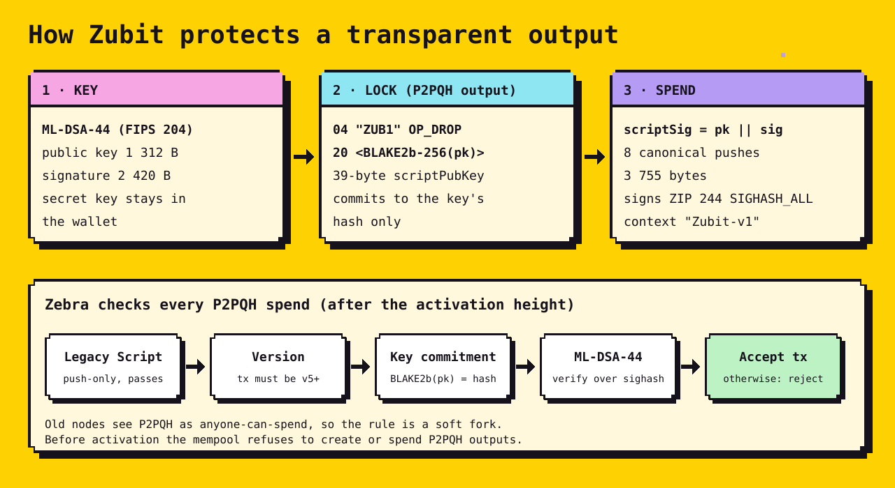
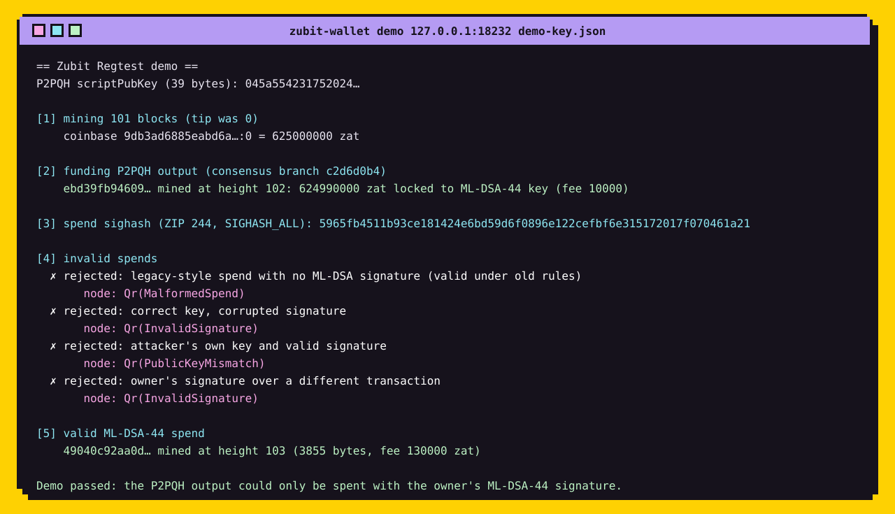

<p align="center">
  
</p>

<p align="center">
  <b>Post-quantum ML-DSA-44 signatures for transparent ZEC, as a soft fork in the Zebra node.</b><br>
  <sub>Research fork of <a href="https://github.com/ZcashFoundation/zebra">Zebra</a> v6.4.2 · runs on a local Regtest chain · not active on Zcash mainnet or testnet</sub>
</p>

---

## Why

Transparent Zcash outputs are protected by ECDSA on secp256k1. A large quantum computer running
Shor's algorithm could recover those private keys and spend the coins.

Zubit adds a new kind of transparent output, **P2PQH** (pay-to-post-quantum-pubkey-hash), that can
only be spent with an **ML-DSA-44** signature — the NIST-standardized lattice signature scheme
(FIPS 204). Zebra enforces the rule from a configured activation height.

## How it works

<p align="center">
  
</p>

- **Output:** `04 "ZUB1" OP_DROP 20 <BLAKE2b-256(pk)>` — 39 bytes, commits only to a hash of the key.
- **Spend:** the `scriptSig` carries `pk || sig` (1 312 + 2 420 bytes) in canonical 520-byte pushes.
- **Signed message:** the ZIP 244 `SIGHASH_ALL` digest of the input, with FIPS 204 context `"Zubit-v1"`.
- **Soft fork:** under the old rules a P2PQH output is anyone-can-spend, so old nodes accept every
  block Zubit nodes accept. No new transaction version, no change to the C++ script interpreter.
- **Mempool:** before activation, Zebra refuses to create or spend P2PQH outputs (they would be
  unprotected). After activation, P2PQH spends are standard despite their larger `scriptSig`.

Full design: [`zubit/DESIGN.md`](zubit/DESIGN.md).

## It runs

A real `zebrad` node on Regtest, driven by the included `zubit-wallet` tool: fund a P2PQH output,
try four invalid spends, then spend it with the owner's key.

<p align="center">
  
</p>

## Quick start (Regtest)

Requirements: Rust (pinned by `rust-toolchain.toml`), a C++ toolchain, and LLVM/libclang
(`LIBCLANG_PATH`) for RocksDB. See [`README.zebra.md`](README.zebra.md) for Zebra's full build notes.

```bash
cargo build -p zebrad -p zubit-wallet
```

```bash
target/debug/zebrad -c zubit/regtest.toml start
```

In a second terminal:

```bash
target/debug/zubit-wallet keygen demo-key.json
```

```bash
target/debug/zubit-wallet demo 127.0.0.1:18232 demo-key.json
```

The Regtest config ([`zubit/regtest.toml`](zubit/regtest.toml)) activates NU5 and the Zubit
rule at height 1. Its miner address is `P2SH(OP_TRUE)`, so demo funds are spendable without ECDSA.

## Tests

```bash
cargo test -p zebra-script qr
```

```bash
cargo test -p zebra-chain qr_soft_fork
```

```bash
cargo test -p zebra-network regtest_qr_soft_fork
```

```bash
cargo test -p zebra-consensus mempool_qr_policy
```

The `zebra-script` tests include a full-verification test through the real script interpreter:
the same legacy-style spend passes without the soft fork and is rejected with it.

## What changed in Zebra

| Crate | Change |
|---|---|
| `zebra-script` | new `qr` module: P2PQH template, canonical spend encoding, ML-DSA-44 verification; `CachedFfiTransaction::with_qr_rules` |
| `zebra-consensus` | enables the rule at the activation height for block and mempool transactions; P2PQH-aware standardness; pre-activation mempool policy |
| `zebra-chain` | `qr_soft_fork_height` network parameter (never set on Mainnet) |
| `zebra-network` | `qr_soft_fork_height` in the `testnet_parameters` config |
| `zebrad` | mempool storage accepts P2PQH outputs and spends |
| `zubit-wallet` | new demo tool: keygen, transaction building, ZIP 244 sighash, ML-DSA-44 signing, RPC |

## Status and limits

- [x] Consensus rule, mempool policy, activation parameter
- [x] Unit and full-interpreter tests
- [x] End-to-end Regtest demo on a real node
- [ ] Draft ZIP
- [ ] Independent review / audit
- [ ] Fee rule for large post-quantum inputs (a spend is ~3.9 KB, ~26 ZIP 317 actions)

This is **research code**. It is not audited and is not part of the Zcash protocol. It could only
reach mainnet through a ZIP and a network upgrade adopted by the Zcash community.

What it does **not** cover: existing t-addresses, Sapling, and Orchard are unchanged. Moving funds
into a P2PQH output still uses one classical signature, so it has to happen before a quantum
attacker exists.

## Credits

Built on [Zebra](https://github.com/ZcashFoundation/zebra) by the Zcash Foundation (MIT OR Apache-2.0);
the original README is in [`README.zebra.md`](README.zebra.md). ML-DSA via the
[`fips204`](https://crates.io/crates/fips204) crate. Code is released under the same licenses as Zebra.
